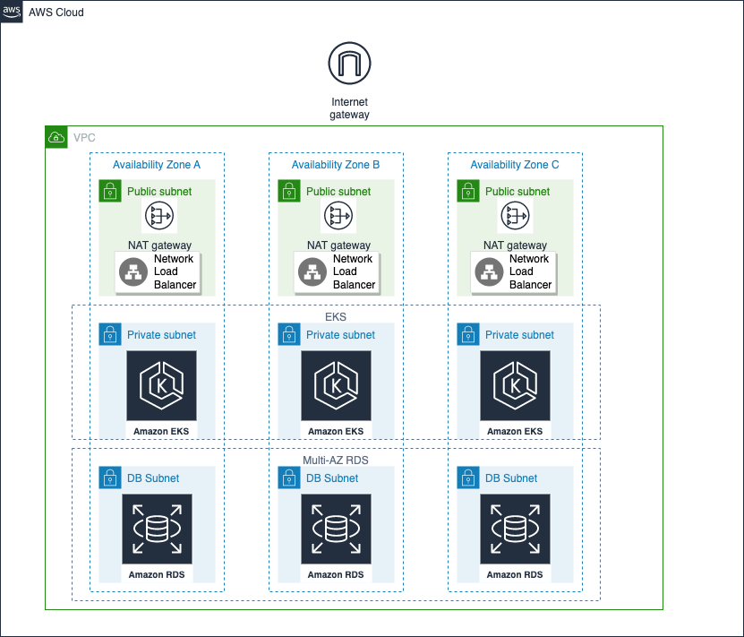
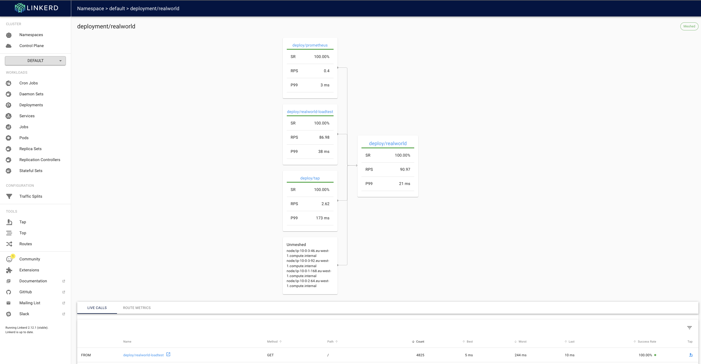
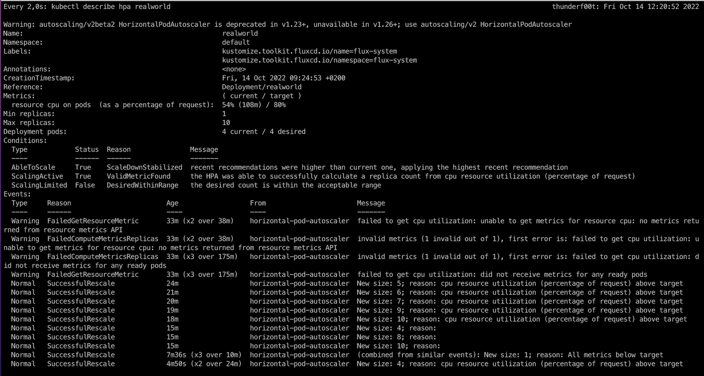

# Architecture

This is a fork from https://github.com/remast/gobuff_realworld_example_app

As shown in the picture, we have a VPC which get divided into public/private/db
subnet groups. Each group has three subnets for three availability zones.

In the public subnets we have a network load balancer that works as an ingress
for the kubernetes cluster.  Additionally, we have NAT gateways so that the
ec2 / pods in the private subnets can talk to the internet and e.g. download
container images.

The node-group for the eks cluster lives in the private subnets. It is auto-scaled by [karpenter](https://karpenter.sh/).
The cluster is configured so that the control plane and all the pods are synced to cloudwatch logs.

In the DB subnets we have a multi-az RDS which automatically creates a backup every night.
The DB writes its logs to cloudwatch logs as well.

# Github
In github we have workflows for:
* [renovatebot](https://github.com/renovatebot/renovate) for keeping all versions up-to-date
* [semantic-release](https://github.com/semantic-release/semantic-release) for
  having releases with meaningful version numbers by relying on [conventional
  commits](https://www.conventionalcommits.org/en/v1.0.0/)
* build a new container image for the app
* scanning the container for vulnerabilities with [grype](https://github.com/anchore/grype)
* upload newly build container image into github container registry
* terraform linters, e.g. `terraform validate`, `tflint`, `tfsec`
* run `go test`
* `golangci-lint` is prepared but needs fixes first

# Terraform
Terraform is used for the initial setup of the cluster and resources that are required by the realworld app.
All terraform stacks can be easily applied by using `terraform-apply.sh`.
Releases of the app are not done by terraform. We use flux instead. If the
cluster is not needed anymore it can be destroyed with `terraform-destroy.sh`.
The terraform files are in `infrastructure/terraform`.

Since we don't have an official dns domain, after the apply we need to:
1) determine the name of the network loadbalancer: `kubectl -n ingress-nginx get svc ingress-nginx-controller`
2) lookup its IPs: `host af1bed0fa00784cab931708741826eab-1943719008.eu-west-1.elb.amazonaws.com`
3) add an entry in `/etc/hosts`, e.g: `34.242.148.29 realworld.takehome.local`
4) be sure to ignore invalid tls certificates, e.g. `curl -k https://realworld.takehome.local/` or type `thisisunsafe` in chrome

# GitOps
We use [flux](https://fluxcd.io/) for installing apps on the kubernetes cluster.
The flux files are in `infrastructure/flux`.
Flux is polling the github registry for new container images. When it sees a
new version it will update the k8s deployment resource with the new version and
git commit/push it. This will trigger [flagger](https://flagger.app/) which
will start a canary release. The release will only succeed when during the
rollout certain metrics are fullfilled:
* minimum of 99% of non 5xx responses
* maximum of req duration for P99 is 500ms

# Logs and Metrics
Apart from the cloudwatch logs we can see metrics like req duration or success rate in the linkerd viz dashboard:

# Autoscaling
We have [karpenter](https://karpenter.sh/) for scaling the node-group and we use the horizontal pod autoscaler for scaling the realworld app depending on cpu load.
This can be seen here:

# TODOs
* have an official DNS domain with official tls certificate
* have external monitoring to the URL e.g. [pingdom](https://www.pingdom.com/)
* tune requests/limits of the pods
* currently the eks api endpoint is public. In a real production scenario, the
  api endpoint should be restricted to the VPC. Since terraform needs to reach
  the endpoint, we need to introduce e.g. a bastion host.
* fine tune security groups and NACLs to allow only the necessary access and
  block everything else
* reconfigure the app so that it uses ssl encryption when talking to the RDS
* fix issue in golang code so that we can reactivate the currently disabled
  golangci-lint github-action
